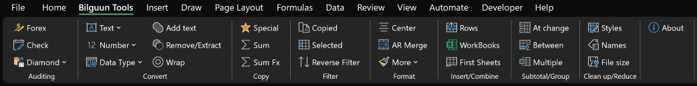

# Excel Add-ins

A collection of Excel add-ins developed between 2014-2016.

This was an old project of mine when I was still learning how to code, so the structure may not be the best. However, these add-ins still come in handy from time to time and work great. I'm sharing this on GitHub as a public archive in case it helps others.

## Screenshot

## Installation
1. Download the .xlam file.
2. Open Excel and navigate to **File > Options > Add-ins**.
3. Click **Go** next to "Manage: Excel Add-ins".
4. Click **Browse** and select the downloaded add-in file(s).
5. Enable the add-in(s).

## License
Feel free to use, modify, and distribute this project under the [MIT License](link-to-license-file).

## Disclaimer
This is an archived project and may not be maintained or updated. Use at your own risk.
